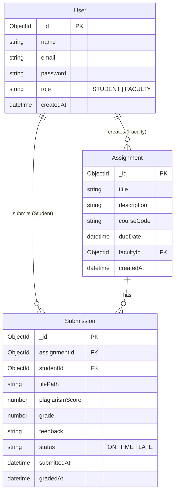

# Database Schema Documentation

This directory contains the JSON schema definitions for the LMS project.

## Entity Relationship Diagram

## Collections

### 1. User
Stores authentication and profile information for both Students and Faculty.
- **role**: Determines access level (RBAC).

### 2. Assignment
Created by Faculty to track coursework.
- **facultyId**: Links to the creator.

### 3. Submission
Created by Students when uploading work.
- **assignmentId**: Links to the specific assignment.
- **studentId**: Links to the student.
- **plagiarismScore**: Mock score generated upon submission.
